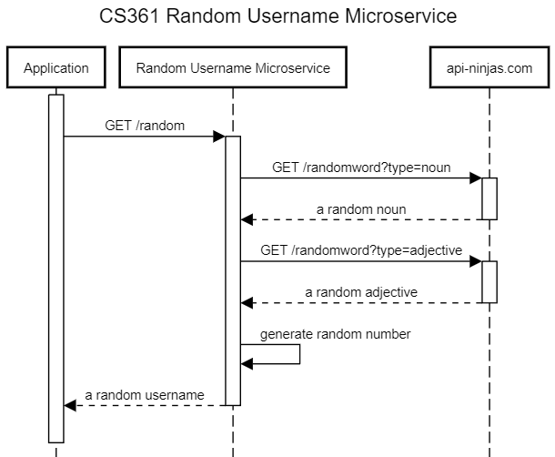
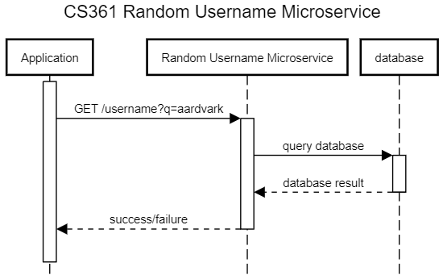
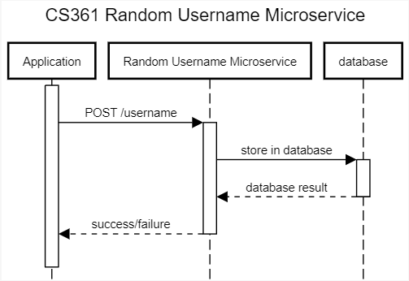

# CS 361 Random Username Microservice

Base URL: https://cs361-towlerj-microservice.herokuapp.com

This random username microservice is deployed to Heroku! You will need to make HTTP requests to send and receive data from the microservice.

## Requesting Data

### GET /random

https://cs361-towlerj-microservice.herokuapp.com/random

#### Request Body Example
None

### GET /username?q=username

https://cs361-towlerj-microservice.herokuapp.com/username?q=aardvark

#### Request Body Example
None

### POST /username

https://cs361-towlerj-microservice.herokuapp.com/username

#### Request Body Example

```http request
{
    "username": "lonely_iguana_432"
}
```

## Receiving Data

Data will be sent from the server in JSON format

### GET /random

```http request
Status: 200
{
    "username": "random_username_123"
}
```

### GET /username?q=username

```http request
Status: 200 Success
{
    "msg": "Username found."
}

Status: 404 Not Found
{
    "error": "Username not found."
}

Status: 500 Internal Server Error
{
    "error": "Internal Server Error."
}
```

### POST /username

```http request
Status: 201 Success
{
    "msg": "Success."
}

Status: 403 Forbidden
{
    "error": "Username has already been used."
}

Status: 500 Internal Server Error
{
    "error": "Internal Server Error."
}
```

## Diagram

### GET /random


### GET /username?q=aardvark


### POST /username

